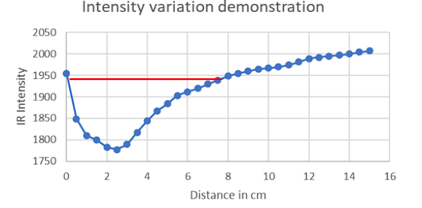
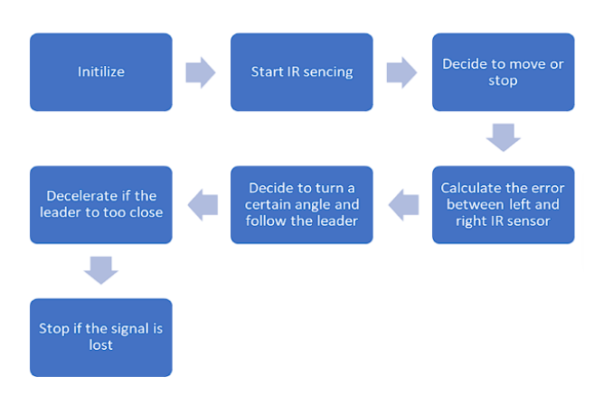
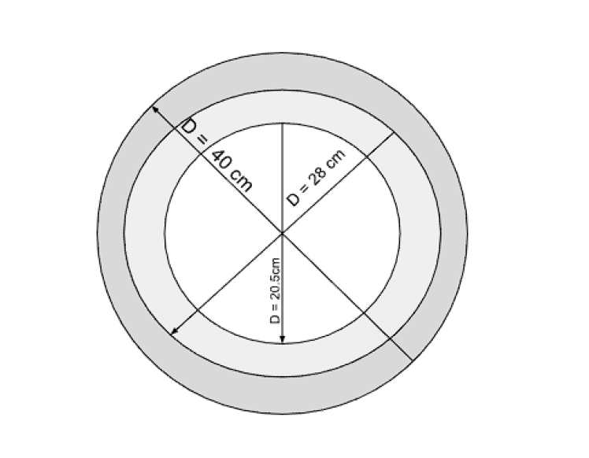

# IR-Based Leader–Follower Robotics System

## Overview
This project investigates the stability of a **leader–follower robotic system** using low-cost **infrared (IR) sensing**. The system consists of two **Pololu 3pi+ robots**, where the leader generates a trajectory and the follower attempts to track it using only local IR intensity measurements.

The main focus of the work is to understand how **path curvature, robot speed, and control gain** affect tracking stability when navigating circular trajectories.

---

## System Setup
- **Robot Platform:** Pololu 3pi+ 32U4
- **Programming Language:** C++
- **Architecture:** Leader–Follower
- **Sensing:** Infrared intensity using the reflectance sensor array

### Leader Robot
- Drives along circular paths of different radii
- Projects a continuous IR signal onto the floor using onboard emitters
- Acts as a moving reference trajectory

### Follower Robot
- Uses two inner reflectance sensors to detect IR intensity
- Tracks the leader’s path by maintaining equal sensor readings
- Operates fully autonomously with onboard control

---

## Control Approach
The follower uses a **Proportional (P) controller** to minimise lateral deviation from the leader’s trajectory.

- **Error signal:**  
  Difference between left and right IR sensor readings  
- **Control law:**  
  Steering correction = Kp × error  
- **Motor control:**  
  Differential adjustment of left and right wheel speeds

A safety mechanism reduces speed if the IR signal is lost or exceeds the effective tracking range.

---

## Experimental Method
The system was evaluated using a **parameter sweep** across:
- **Path curvature:**  
  Small, medium, and large circular trajectories
- **Base speed**
- **Proportional gain (Kp)**
- **Surface type:** smooth vs rough floor

Each configuration was tested repeatedly to assess consistency and stability.

---

## Key Findings
- **Stability–Curvature Trade-off:**  
  Tighter curves require higher control gain but lower stable speeds.
- **Optimal Gain Range:**  
  Very low gain leads to under-steering; very high gain causes oscillations.  
  An intermediate gain provides the best balance.
- **Velocity Effects:**  
  On tight curves, slightly higher speeds can improve tracking by overcoming static friction.
- **Environmental Sensitivity:**  
  Performance degrades significantly on rough surfaces, showing the need for retuning.

---

## Results Summary
- The system achieved stable tracking within ±2 cm on smooth surfaces.
- No single control setting works across all curvatures and environments.
- Reliable operation requires matching speed and gain to trajectory geometry.

---

## Limitations and Future Work
- The controller uses a fixed proportional gain.
- Performance is sensitive to surface properties.

Future improvements include:
- Gain scheduling or adaptive PID control
- Distance sensing to regulate following range automatically

---

## Contributing
Contributions and feedback are welcome! If you find any issues or have suggestions for improvements, please feel free to open an issue or submit a pull request.

---

## Contact
For any inquiries or further information, you can reach me at dskapsit@gmail.com

Thank you! 

**Figure 1: IR Intensity Curve demonstrating the non-linear response of the reflectance sensors to the leader’s projected signal.**   The red line highlights the effective linear tracking region.*

**Figure 2: Control logic flowchart describing the decision-making process for the follower robot.**

**Figure 3: Schematic representation of the three experimental path geometries.**  
The distinct diameters (D = 20.5 cm, D = 28 cm, and D = 40
cm) correspond to the High, Medium, and Low curvature test cases used
to evaluate the system’s tracking stability.*

